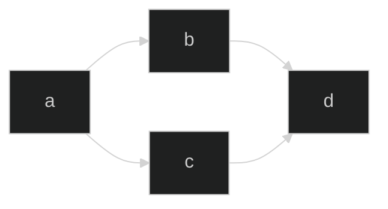

# Markdown Demo

## External 1.1

Content 1.1

***

## External 1.2

Content 1.2

Note:

This will only display in the notes window.

***

### List & fragments

* unordered <!-- .element: class="fragment" -->
* list <!-- .element: class="fragment" -->
* with `code`  <!-- .element: class="fragment" -->
* with __bold__ text <!-- .element: class="fragment" -->

Notes:

- some other points only
- in the nodes

***

### List in HTML

<ul>
<li>List</li>
<li class="fragment">with <code>code</code></li>
<li class="fragment">with <strong>bold</strong> text</li>
</ul>

---

## External 2

Content 2.1

---

## External 3.1

Content 3.1

***

## External 3.2

Content 3.2

***

## External 3.3


---
<!-- .slide data-menu-title="Abla Habla" -->

## External 4.1

 <!-- .element: class="r-stretch" -->

***

## External 4.2

<a href="https://www.google.com">Google</a>

---

## Code

```csharp
var i = 10;
for (var j = 0; j < i; j++) {
    Console.WriteLine($"{j}");
}
```

***

### Mermaid



***

### The inadequacy of a non-highlighted being

{line-numbers="1-2|3|4"}

```js
let a = 1;
let b = 2;
let c = x => 1 + 2 + x;
c(3);
```